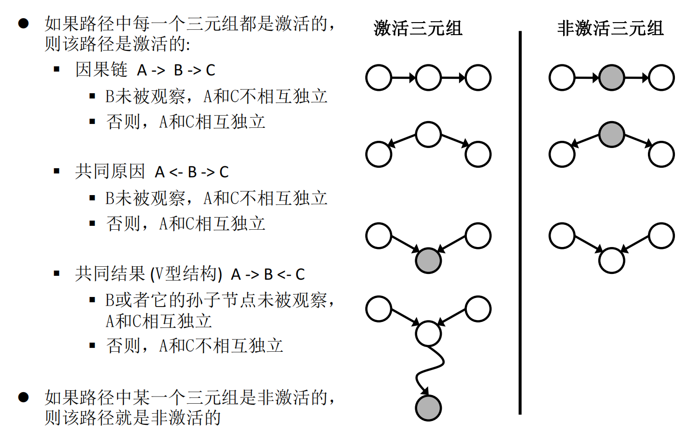

## 贝叶斯网络
### 全局语义

\(P(x_1,x_2,...x_n) = \prod_i P(x_i|parent(x_i))\)

和联合概率分布链式法则对比：

\(P(x_1,x_2,...x_n) = \prod_i P(x_i|x1,x2,...x_{i-1})\)

可以发现，如果规定 \(x_i\) 的子节点序号比 \(i\) 大，也即按照拓扑顺序进行存储，根据条件独立性，可以推导出贝叶斯网络的局部语义

### 局部语义
给定其父结点，每个变量条件独立于它的非子孙节点

（注意，其他未定义的条件独立性没有保证）

### D-分离
给定一系列节点  \(x_{k1},x_{k2},...x_{kn}\)，如何判定网络中某对节点 \((x_i,x_j)\) 是否条件独立？

考察从 \(x_i\) 到 \(x_j\) 的所有路径，如果所有路径均未激活（条件独立），则\((x_i,x_j)\) 条件独立，反之条件不独立

**V型观察则激活，其余观察则不激活**

### 构建贝叶斯网络

1.  **变量确定与排序**：首先，确定建模所需的所有随机变量，并将它们排序为序列 \( X_1, \ldots, X_n \)。这个顺序至关重要，**原因变量应排在结果变量之前**。
2.  **迭代添加节点与父节点选择**：
    *   按\( X_1-X_n\)顺序将变量 \( X_i \) 加入网络。
    *   从它前面的变量 \( X_1, \ldots, X_{i-1} \) 中，选择一个**最小**的父节点集合 `Parents(X_i)`，使得条件独立性成立,并构建从 Parent 到节点的有向边：

      \[
      P(X_i | \text{Parents}(X_i)) = P(X_i | X_1, \ldots, X_{i-1})
      \]

    *   **实践指导**：通常依据**因果关系**来选择父节点，这通常能得到最直观、最简洁的网络。

### 条件概率计算
根据贝叶斯网络进行条件概率计算，首先把条件概率归一化为联合概率，再使用贝叶斯网络全局语义计算

